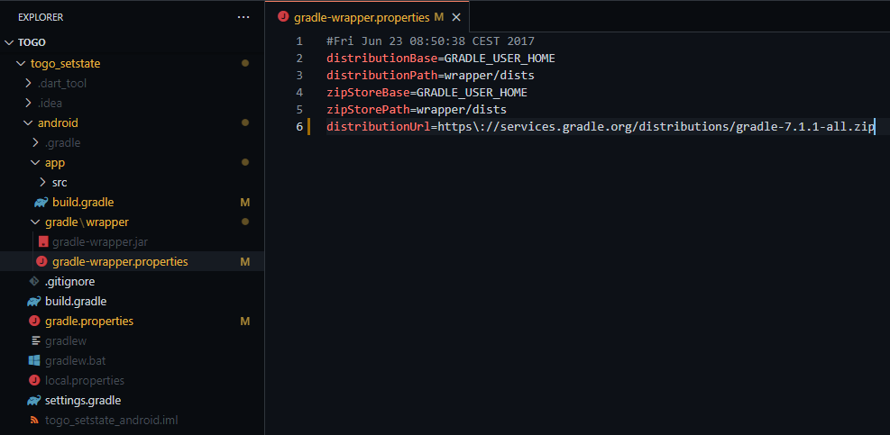
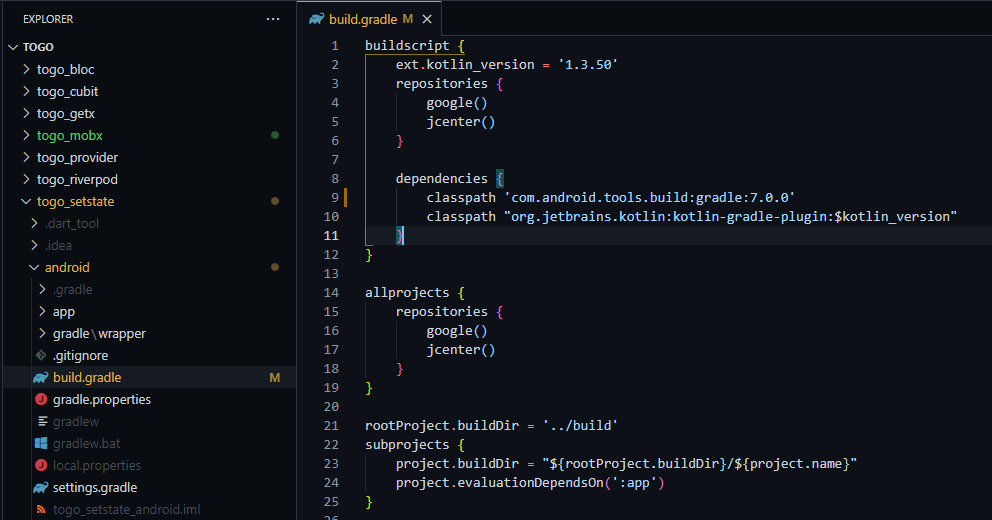
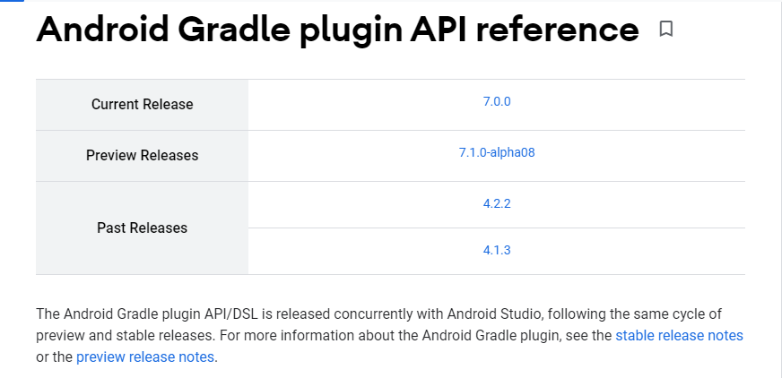

# fgradle
Improving Gradle build time in a default Flutter project.

## Step 1

Change default minSdkVersion at file android/app/build.gradle from 16 to 21


## Step 2

Change default Gradle properties that you can find at file android/gradle.properties.\
The value of 4096 will depends on your RAM. You can change to 3096 or 2048 for lower RAM.


Here is the copy paste version:

```
#Enable daemon
org.gradle.daemon=true

# Try and findout the best heap size for your project build.
org.gradle.jvmargs=-Xmx4096m -XX:MaxPermSize=512m -XX:+HeapDumpOnOutOfMemoryError -Dfile.encoding=UTF-8

# Modularise your project and enable parallel build
org.gradle.parallel=true

# Enable configure on demand.
org.gradle.configureondemand=true

android.useAndroidX=true
android.enableJetifier=true
```

## Step 3

Change the default distributionUrl at file android/gradle/wrapper/gradle-wrapper.properties to the latest version.\
You can check the latest gradle version at [this link](https://gradle.org/releases/).

Your build will be a lot slower after you change distributionUrl to latest version, because it needs to download the latest gradle file. But it will be faster at your next build.



You also need to change gradle dependencies at file android/gradle.build to the latest Android Gradle Plugin version.\
You can check the latest Android Gradle Plugin version [here](https://developer.android.com/studio/releases/gradle-plugin) and [here](https://developer.android.com/reference/tools/gradle-api?hl=BG).



See current release.



# Step 4

To easily monitor the process of gradle build and detect when it's stuck. Always use -v when you build from command line.

```
$ flutter run -v
```

```
$ flutter run --profile -v
```

```
$ flutter run --release -v
```

```
$ flutter build apk --split-per-abi -v
```
