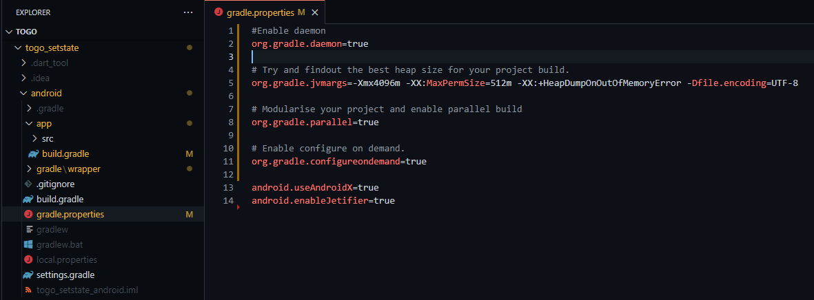

# fgradle
Improving Gradle build time in a default Flutter project.

## Step 1

Change default minSdkVersion at file android/app/build.gradle from 16 to 21


## Step 2

Change default Gradle properties that you can find at file android/gradle.properties.\
The value of 4096 will depends on your RAM. You can also change it into 3096 or 2048 for lower RAM.



Here is the copy paste version:

```
#Enable daemon
org.gradle.daemon=true

# Try and findout the best heap size for your project build.
org.gradle.jvmargs=-Xmx4096m -XX:MaxPermSize=512m -XX:+HeapDumpOnOutOfMemoryError -Dfile.encoding=UTF-8

# Modularise your project and enable parallel build
org.gradle.parallel=true

# Enable configure on demand.
org.gradle.configureondemand=true

android.useAndroidX=true
android.enableJetifier=true
```

## Step 3

Change the default distributionUrl value at file android/gradle/wrapper/gradle-wrapper.properties to the latest version.\
You can check the latest version of gradle from [this link](https://gradle.org/releases/).

Your build will be slower after you change distributionUrl to the latest version, because it needs to download the latest gradle file. But it will be faster for the next build.


